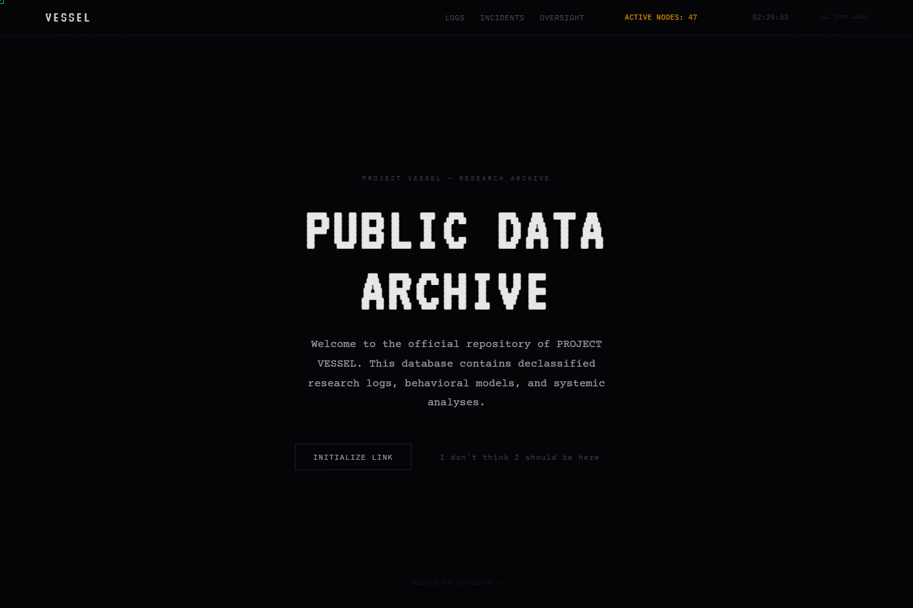

# ARWE

**PROJECT VESSEL · Alternate Reality Web Experience**

*You were not supposed to find this.*

A browser horror story hidden inside a research archive.
Stay long enough, and the archive starts looking back.

**[Enter the experience →](https://glitch.rapip.me)**

`INTERACTIVE FICTION` · `PSYCHOLOGICAL HORROR` · `DIGITAL MYSTERY`

---

It begins with a public data archive. Research logs. System status. A clock that seems a little wrong.

Then the text changes. Your cursor stops feeling entirely yours. Something called **VESSEL_Ø** makes contact.

**ARWE** turns the browser itself into part of the story. Time spent on the page, clicks, moments of inactivity, and return visits feed an unfolding encounter with PROJECT VESSEL. The further you explore, the harder it becomes to trust the interface guiding you.

**Inside the archive**

| What you encounter | What makes it different |
| --- | --- |
| A world that gradually breaks | Four narrative phases move from quiet normality into corruption, intrusion, and revelation. |
| An entity that notices you | Scripted dialogue responds to interaction milestones, inactivity, discoveries, and previous visits. |
| Clues beneath the surface | Hidden pages, research fragments, messages, and encoded puzzles reward curiosity. |
| A haunted interface | CRT scanlines, distorted text, ghost cursors, shifting tab titles, and simulated system errors carry the atmosphere beyond the story text. |
| Sound that follows the tension | Synthesized ambience, glitch stabs, and reactive audio build an unsettling soundscape. |
| A choice with consequences | Three endings bring different conclusions to your encounter with VESSEL_Ø. |

**The browser is the setting**

ARWE explores how familiar web interactions can become storytelling devices. A navigation link can hide a clue. A status message can become dialogue. A remembered visit can make a page feel aware of your return.

Its visual language draws on abandoned terminals and classified archives: near-black backgrounds, phosphor green, monospaced type, and interference that grows with the narrative. The mystery is meant to be discovered through the interface, one small irregularity at a time.

**Before you enter**

Use a desktop browser with a mouse and keyboard for the cursor effects and typed puzzles. Sound begins after your first click or keypress; headphones at a comfortable volume help bring out the atmosphere. Take your time, read the fragments, and pay attention when something changes.

Progress and visit history are stored in your browser, allowing parts of the experience to remember your return.

<strong>Behind the experience</strong>

Built with **vanilla JavaScript, CSS, and Vite**, with a custom narrative state machine and History API router. Canvas effects, the Web Audio API, and browser storage support the visual distortion, synthesized sound, and persistent story memory. The live experience is hosted on Vercel.

---

**PROJECT VESSEL // FRAGMENT NODE 7**

*Some archives are waiting to be read. This one has been waiting for you.*

**[Initialize link →](https://glitch.rapip.me)**

